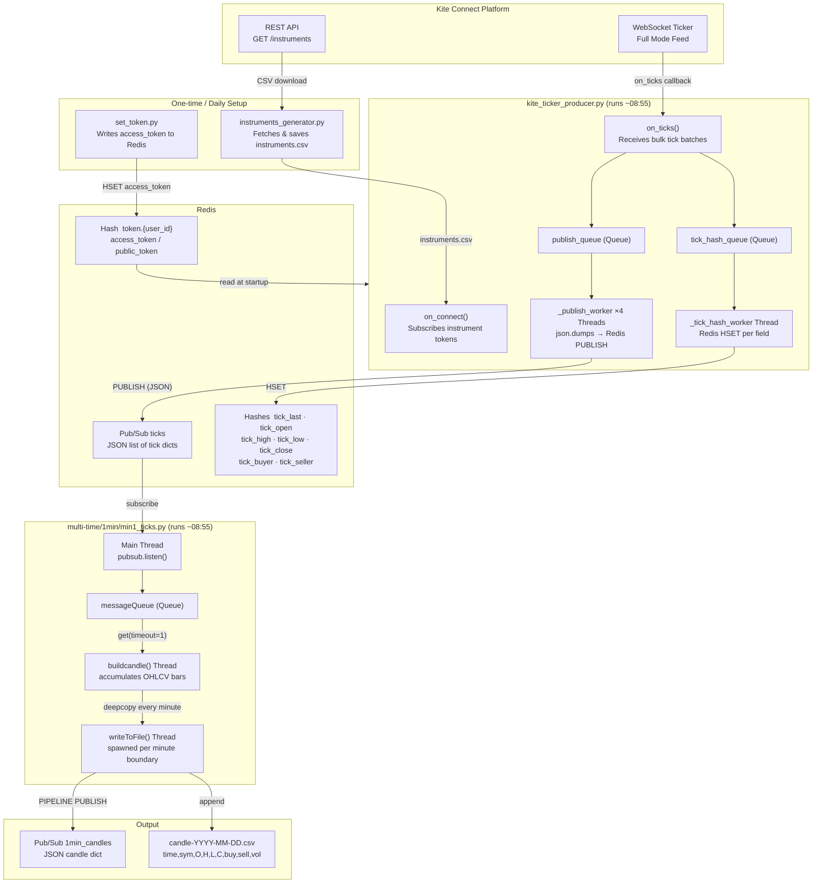
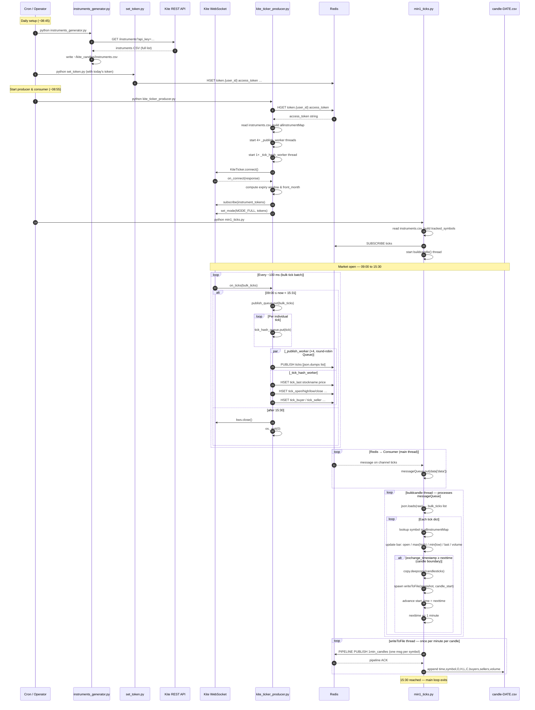

# Kite Candles — Real-Time OHLCV Candle Generator

Streams live tick data from the **Zerodha Kite WebSocket** feed, fans it out through **Redis Pub/Sub**, and assembles it into **OHLCV candles** in real time. The architecture is deliberately split so that one producer feeds unlimited timeframe consumers (1-min, 5-min, 15-min, 1-hour) without any changes to the producer.

---

## Table of Contents

1. [Architecture Overview](#architecture-overview)
2. [Architectural Diagram](#architectural-diagram)
3. [Sequence Diagram](#sequence-diagram)
4. [Module Descriptions](#module-descriptions)
5. [Threading Model](#threading-model)
6. [Wire Formats](#wire-formats)
7. [Redis Key Reference](#redis-key-reference)
8. [Configuration & Setup](#configuration--setup)
9. [Running the System](#running-the-system)
10. [Extending to Other Timeframes](#extending-to-other-timeframes)

---

## Architecture Overview

```
┌──────────────────────────────────────────────────────────────────────┐
│                        Kite Connect Platform                         │
│                                                                      │
│   ┌─────────────────────────┐    ┌──────────────────────────────┐   │
│   │  REST API               │    │  WebSocket Ticker (WSS)      │   │
│   │  GET /instruments       │    │  Full mode — all fields       │   │
│   └────────────┬────────────┘    └──────────────┬───────────────┘   │
└────────────────│──────────────────────────────── │ ──────────────────┘
                 │                                  │
                 ▼                                  ▼
   ┌─────────────────────────┐      ┌───────────────────────────────────┐
   │ instruments_generator   │      │      kite_ticker_producer.py      │
   │ .py                     │      │                                   │
   │                         │      │  WebSocket callbacks:             │
   │  • Fetches full NSE/NFO │      │  on_connect → subscribe tokens    │
   │    instrument list      │      │  on_ticks   → fan-out to queues   │
   │  • Polls until valid    │      │  on_error   → log & continue      │
   │  • Writes instruments   │      │  on_close   → log                 │
   │    .csv                 │      │  on_order_update → write log file │
   └────────────┬────────────┘      │                                   │
                │                   │  Queues & Workers:                │
                ▼                   │  publish_queue → 4 pub threads    │
          instruments.csv           │  tick_hash_queue → 1 hash thread  │
                │                   └─────────────┬─────────────────────┘
                │                                 │
                └──────► [read on connect]         │
                                                   │
                          ┌────────────────────────┼────────────────────┐
                          │                        │                    │
                          ▼                        ▼                    ▼
              ┌───────────────────┐  ┌─────────────────────────┐  ┌──────────────────┐
              │  Redis Pub/Sub    │  │  Redis Hash: tick_last   │  │  {user}-order    │
              │  channel: ticks   │  │  Redis Hash: tick_open   │  │  .log            │
              │                   │  │  Redis Hash: tick_high   │  │  (order updates) │
              │  JSON payload:    │  │  Redis Hash: tick_low    │  └──────────────────┘
              │  list of ticks    │  │  Redis Hash: tick_close  │
              └────────┬──────────┘  │  Redis Hash: tick_buyer  │
                       │             │  Redis Hash: tick_seller  │
                       │             └─────────────────────────┘
                       │
                       ▼
         ┌─────────────────────────────────┐
         │   multi-time/1min/min1_ticks.py │
         │                                 │
         │   Main thread: pubsub.listen()  │
         │   → messageQueue                │
         │                                 │
         │   buildcandle thread:           │
         │   • json.loads(raw)             │
         │   • accumulates OHLCV bars      │
         │   • every minute boundary →     │
         │     spawn writeToFile thread    │
         │                                 │
         │   writeToFile thread:           │
         │   • Redis pipeline publish      │
         │   • Append to CSV              │
         └──────────┬──────────────────────┘
                    │
        ┌───────────┴───────────┐
        │                       │
        ▼                       ▼
 ┌─────────────────┐   ┌────────────────────────┐
 │ Redis Pub/Sub   │   │ candle-YYYY-MM-DD.csv   │
 │ channel:        │   │                         │
 │ 1min_candles    │   │ time,symbol,O,H,L,C,    │
 │ (JSON per bar)  │   │ buyers,sellers,volume   │
 └─────────────────┘   └────────────────────────┘
```

---

## Architectural Diagram



---

## Sequence Diagram



---

## Module Descriptions

### `set_token.py`

**Purpose:** One-time daily bootstrap. Stores today's Kite access token in Redis so all other processes can read it without touching the filesystem.

| Detail | Value |
|--------|-------|
| Reads from | `~/kite_candles/userdata` (JSON) |
| Writes to | Redis hash `token.{user_id}` |
| Fields written | `access_token`, `public_token` |
| When to run | After generating a new session token each morning |

You replace `YOUR ACCESS TOKEN` with the token you obtain from the Kite login flow (or your automated token-generation script), then run this once before starting the producer.

---

### `instruments_generator.py`

**Purpose:** Downloads the complete NSE/NFO instrument master from the Kite REST API and saves it locally. The instrument CSV maps `instrument_token` integers (used in WebSocket ticks) to human-readable `tradingsymbol` strings.

| Detail | Value |
|--------|-------|
| Endpoint | `GET https://api.kite.trade/instruments` |
| Output | `~/kite_candles/instruments.csv` |
| Retry behaviour | Polls every 15 s until a response > 2 048 bytes arrives |
| When to run | Daily before market open (crontab ~06:00) |

The file is large (~500 KB) and contains all exchanges. Both the producer and the consumer read it at startup to build their in-memory `instrument_token → tradingsymbol` maps.

---

### `kite_ticker_producer.py`

**Purpose:** Maintains a persistent WebSocket connection to Kite, receives every market tick in real time, and fans each batch out to two Redis destinations simultaneously.

#### Startup sequence
1. Reads `userdata` for `api_key` and `user_id`.
2. Reads `access_token` from Redis hash `token.{user_id}`.
3. Starts **4 publish worker threads** (`_publish_worker`) all draining a single `publish_queue`.
4. Starts **1 tick-hash worker thread** (`_tick_hash_worker`) draining `tick_hash_queue`.
5. Opens the Kite WebSocket and registers callbacks.

#### `on_connect` — instrument subscription
- Computes the nearest weekly options expiry and the front futures month.
- Builds a combined universe: `NIFTY`/`BANKNIFTY` options + front-month futures for all F&O stocks + NSE cash equities for the same names + `NIFTY 50`, `NIFTY BANK`, `INDIA VIX` indices.
- Subscribes all tokens in `MODE_FULL` (full market depth + OHLC + volume).
- Builds `allinstrumentMap` covering the *entire* instrument master (used by the hash writer for any token).

#### `on_ticks` — per-batch callback
- Runs on the WebSocket thread; must be fast (no I/O here).
- Puts the entire batch into `publish_queue` (→ Redis pub/sub).
- Puts each individual tick into `tick_hash_queue` (→ Redis hashes).
- Calls `os._exit(0)` if invoked outside 09:00–15:30 (market closed).

#### `_publish_worker` (×4 threads)
- Serialises the tick batch to JSON using `_DatetimeEncoder` (handles `datetime`/`date` objects as ISO-8601 strings).
- Publishes to Redis channel **`ticks`**.
- Four threads share one `Queue` — if one publish blocks on network, the others continue.

#### `_tick_hash_worker` (×1 thread)
- Writes per-symbol real-time price fields into Redis hashes for any consumer that needs last-price lookups without processing the full tick stream.

#### `on_order_update`
- Appends every order update as a JSON line to `{user_id}-order.log`.

---

### `multi-time/1min/min1_ticks.py`

**Purpose:** Subscribes to the `ticks` Redis channel, maintains a live OHLCV state machine for every tracked symbol, and emits a completed 1-minute candle bar each time a minute boundary is crossed.

#### Startup sequence
1. Reads `instruments.csv` to build `allinstrumentMap` and `tracked_symbols` (the set of symbols this consumer cares about).
2. Subscribes to Redis channel **`ticks`**.
3. Starts the `buildcandle()` thread.
4. Main thread enters `pubsub.listen()` loop, feeding `messageQueue`.

#### Main thread — `pubsub.listen()`
Lightweight receive loop. Only puts the raw bytes into `messageQueue`; no processing. Exits when `datetime.now().time() > 15:29:59`.

#### `buildcandle()` thread
The core state machine. Runs from 09:00 until 15:30.

```
State per symbol per minute:
  candlesticks[symbol][start_time] = {
      open:   first last_price seen in the period
      high:   running maximum
      low:    running minimum
      last:   most recent last_price (becomes close at boundary)
      buyer:  latest total_buy_quantity
      seller: latest total_sell_quantity
      volume: latest volume_traded
  }
```

**Candle boundary logic:**
- `nexttime` tracks when the current bar should close (e.g. 09:01, 09:02, …).
- When `exchange_timestamp` of any incoming tick ≥ `nexttime`, a `copy.deepcopy` snapshot is taken and handed to a fresh `writeToFile` thread.
- `seen_candle_times` (a `set`) guards against re-triggering on ticks with the same timestamp.

**Error handling:** Every tick is wrapped in `try/except`; a bad tick logs the exception and is skipped — the thread never crashes.

#### `writeToFile(candles, start_time)` thread
Receives a deep-copied snapshot so `buildcandle` can immediately continue building the next bar without waiting for I/O.

1. Iterates over all symbols in the snapshot.
2. Batches all Redis `PUBLISH` calls into a single **pipeline** (one network round-trip).
3. Publishes each bar as a JSON dict to channel **`1min_candles`**.
4. Appends all rows to `candle-YYYY-MM-DD.csv` in a single `with open(...)` block.

---

## Threading Model

```
Main Process
│
├── Main Thread
│   └── (producer) KiteTicker.connect() — blocks; drives WebSocket event loop
│   └── (consumer) pubsub.listen()     — blocks; feeds messageQueue
│
├── _publish_worker  ×4   [producer]
│   └── publish_queue.get() → Redis PUBLISH ticks
│
├── _tick_hash_worker ×1  [producer]
│   └── tick_hash_queue.get() → Redis HSET per field
│
├── buildcandle()    ×1   [consumer]
│   └── messageQueue.get(timeout=1) → OHLCV state machine
│
└── writeToFile()    ×N   [consumer — one per minute boundary]
    └── deepcopy snapshot → Redis pipeline + CSV append
```

All worker threads are **daemon threads** — they are killed automatically when the main thread exits. Queues provide the only synchronisation; there are no locks.

---

## Wire Formats

### Redis channel: `ticks`

Published by `kite_ticker_producer.py`. A JSON-encoded list of tick dicts, one list per `on_ticks` callback invocation.

```json
[
  {
    "instrument_token": 256265,
    "exchange_timestamp": "2024-01-15T09:15:03.123456",
    "last_price": 21750.50,
    "total_buy_quantity": 123400,
    "total_sell_quantity": 98700,
    "volume_traded": 4500200,
    "ohlc": {
      "open": 21600.00,
      "high": 21800.00,
      "low":  21550.00,
      "close": 21600.00
    }
  }
]
```

### Redis channel: `1min_candles`

Published by `min1_ticks.py`. One JSON message per symbol per completed minute.

```json
{
  "timestamp":    "09:15",
  "stockname":    "NIFTY 50",
  "candle_open":  21600.00,
  "candle_high":  21750.50,
  "candle_low":   21580.00,
  "candle_close": 21750.50,
  "candle_buyer": 123400,
  "candle_seller":98700,
  "candle_volume":4500200
}
```

### CSV: `candle-YYYY-MM-DD.csv`

```
09:15,NIFTY 50,21600.0,21750.5,21580.0,21750.5,123400,98700,4500200
09:15,RELIANCE,2450.0,2462.5,2448.0,2458.0,34200,28100,980000
09:16,NIFTY 50,21750.5,21780.0,21740.0,21770.0,...
```

Columns: `time, symbol, open, high, low, close, buyers, sellers, volume`

---

## Redis Key Reference

| Key pattern | Type | Written by | Description |
|---|---|---|---|
| `token.{user_id}` | Hash | `set_token.py` | Auth tokens for a user |
| `ticks` | Pub/Sub channel | `kite_ticker_producer.py` | Raw tick batches (JSON list) |
| `tick_last` | Hash | `kite_ticker_producer.py` | Latest last_price per symbol |
| `tick_open` | Hash | `kite_ticker_producer.py` | Day open per symbol |
| `tick_high` | Hash | `kite_ticker_producer.py` | Day high per symbol |
| `tick_low` | Hash | `kite_ticker_producer.py` | Day low per symbol |
| `tick_close` | Hash | `kite_ticker_producer.py` | Previous close per symbol |
| `tick_buyer` | Hash | `kite_ticker_producer.py` | Total buy qty per symbol |
| `tick_seller` | Hash | `kite_ticker_producer.py` | Total sell qty per symbol |
| `1min_candles` | Pub/Sub channel | `min1_ticks.py` | Completed 1-min bars (JSON) |

---

## Configuration & Setup

### Prerequisites

```bash
pip install kiteconnect redis pandas requests
redis-server   # must be running locally
```

### `~/kite_candles/userdata` format

A JSON file read by pandas. Each column is a user profile:

```json
{
  "YOURNAME": {
    "user":   "AB1234",
    "apikey": "your_api_key_here"
  }
}
```

Replace `YOURNAME` with any label; it is used as the column name in all four scripts.

---

## Running the System

Run steps **in order**. Steps 1–3 are one-time or daily; steps 4–5 run each trading day.

```bash
# 1. Generate today's instrument list (run once daily, e.g. crontab 06:00)
python ~/kite_candles/instruments_generator.py

# 2. Store today's access token in Redis (run after Kite login)
#    Edit set_token.py with today's token first, then:
python ~/kite_candles/set_token.py

# 3. Start Redis (if not already running as a service)
redis-server --daemonize yes

# 4. Start the WebSocket producer (~08:55)
python ~/kite_candles/kite_ticker_producer.py

# 5. Start the 1-minute candle consumer (~08:55)
python ~/kite_candles/multi-time/1min/min1_ticks.py
```

Both producer and consumer shut themselves down at market close (15:30–15:31). Schedule them via crontab:

```cron
00 6  * * 1-5  python ~/kite_candles/instruments_generator.py
55 8  * * 1-5  python ~/kite_candles/kite_ticker_producer.py
55 8  * * 1-5  python ~/kite_candles/multi-time/1min/min1_ticks.py
```

---

## Extending to Other Timeframes

The producer is unchanged. For a **5-minute consumer**, copy `multi-time/1min/min1_ticks.py` to `multi-time/5min/min5_ticks.py` and change two values:

```python
# Change the candle width
nexttime = time_increment(start_time, 0, 5)   # was 1
...
nexttime = time_increment(nexttime, 0, 5)      # was 1

# Change the output channel and filename
pipeline.publish('5min_candles', ...)          # was 1min_candles
filename = f"candle5min-{today}.csv"           # was candle-…
```

No changes to the producer are needed — it already publishes all ticks to the `ticks` channel.
